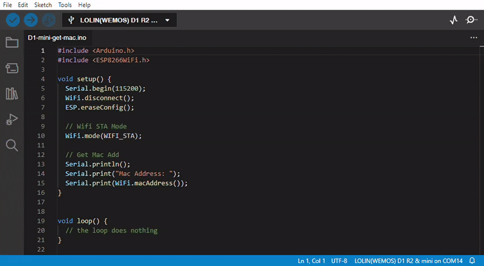

How to get MAC adderesses of the boards 
++++++++++++++++++++++++++++++++++++++++++++

An important step to set up our device is to get the `MAC address <https://en.wikipedia.org/wiki/MAC_address>`_ of our microcontrollers. 
This is necessary to connect the boards using their wireless communication standard: `esp-now <https://docs.espressif.com/projects/esp-idf/en/v4.0.4/api-reference/network/esp_now.html>`_.
In this way our boards will know the "ID" of the board they have to connect with.

To obtain the MAC address of our boards we can upload a very simple code, the following one is for the D1 mini with the ESP8266 microcontroller:

.. code-block:: arduino
    
    #include <Arduino.h>
    #include <ESP8266WiFi.h>

    void setup() {
    Serial.begin(115200);
    WiFi.disconnect();
    ESP.eraseConfig();

    // Wifi STA Mode
    WiFi.mode(WIFI_STA);

    // Get Mac Add
    Serial.println();
    Serial.print("Mac Address: ");
    Serial.print(WiFi.macAddress());
    }

    void loop() {
    // the loop does nothing
    }

This will print the mac address of the device on the serial monitor, which you can open by clicking on its icon on the top-right of the IDE, 
or by going to ``Tools -> Serial Monitor``, or with the shortcut ``Ctrl + Maiusc + M``.

|

|
In this case the MAC address is 48:55:19:C6:6E:30

|

since the network controller of the microcontrollers are managed differently due to the different hardware resources we have to repeat the 
process with the dongle board but with a slightly different code, since the board we are using is based on the ESP32:

.. code-block:: arduino

    #include <Arduino.h>
    #include <WiFi.h>

    void setup() {
    Serial.begin(115200);

    // Set device as a Wi-Fi Station
    WiFi.mode(WIFI_STA);

    // Get Mac Add
    Serial.println();
    Serial.print("Mac Address: ");
    Serial.println(WiFi.macAddress());
    }

    void loop() {
    // the loop does nothing
    }

|
.. image:: get-dongle-mac.gif
   :alt: pref
   :width: 700 px
   :align: center

|
In this case the MAC address is 78:E3:6D:0B:24:04
