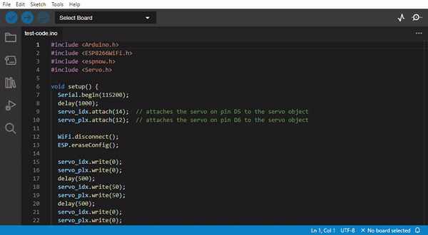

Firmware: an introduction
+++++++++++++++++++++++++

What is a firmware?
====================

Firmware is a type of software that is embedded into a hardware device. It provides the necessary instructions for how the device communicates with the other computer hardware. Firmware is typically stored in the read-only memory of a device and is often the first software to run when powered on. It is responsible for basic operations such as booting up the device, managing system resources and providing an interface for applications to interact with the hardware.

Integrated Development Environment
==================================

An IDE (Integrated Development Environment) is a software application that provides comprehensive facilities to computer programmers for software development. It typically consists of a source code editor, build automation tools, and a debugger. An IDE can make it easier to write and debug code by providing features such as auto-completion, syntax highlighting, and debugging tools.

Arduino IDE 2.0
===============

We will use one of the most simple IDEs that we can find online, and it is the `Arduino IDE 2.0 <https://docs.arduino.cc/software/ide-v2>`_.

Setup the IDE
--------------

 To be able to upload codes to the ESP based boards you need to insert the link of their hardware list.
 Go to File -> Preferences and a window will pop-up. Scroll down and find the box "Additional boards manager URLs".
 Click on the blue icon on the rigth and add the links:
 
 * ``https://dl.espressif.com/dl/package_esp32_index.json``
 * ``https://raw.githubusercontent.com/espressif/arduino-esp32/gh-pages/package_esp32_index.json``

|

Now, clicking on the *Boards Manager* button on the left column you can search for all ESP based boards.