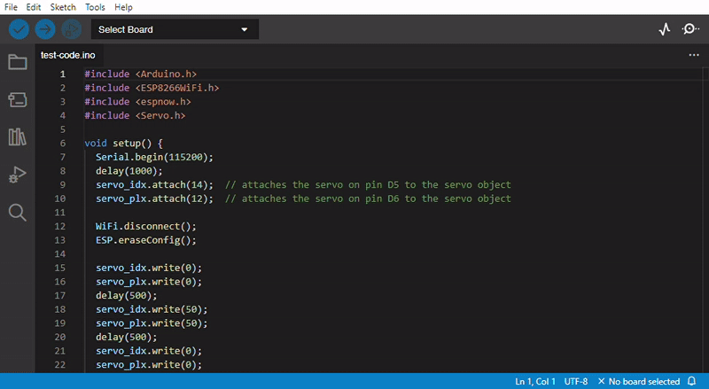
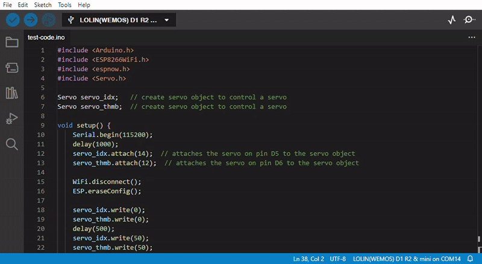

Firmware test code
++++++++++++++++++

To familiarize with the arduino IDE and write our first **firmware code**, we will write and upload a test code into our D1 mini microcontroller.
This code is an example of testing if your device is working as expected.

Setup the environment to program the D1 mini ESP8266 board
============================================================

To upload a code to our microcontroller it is necessary to tell the IDE on which COM port of the computer we connected our device 
and also which board is. This is important because depending on the board the compiler will link different libraries of code and 
also differen hardware definitions of pins. In our case we have to first connect our D1 mini ESP8266 board by using a USB micro 
connector.

.. image:: connect-board.jpg
   :alt: connect board
   :width: 350 px
   :align: center

|

Now we can click on the black drop-down menù which says "Select Board" and now we can click on "Select other board and port...". 
Another window will pop-up: in the left part there is a search bar and we can search for our specific board here. As soon as 
we write "D1" we are left with the first option being "LOLIN(WEMOS) D1 R2 & mini", select it. In the right part of this pop-up 
menù we can select the COM port on which we have connected the board, to identify which to select, next to one of the options 
there is written "(USB)", select that. Now we can click "OK" and the pop-up menù will be closed, and in the bottom-right corner 
of the IDE will now appear which board we intend to program and on what USB COM port it is.

|

The test code
==============

The following code will help you verify that your device is functioning correctly and that all its components are working properly. 
This code will just move the servomotors as soon as the board is powered:

.. code-block:: arduino

    #include <Arduino.h>
    #include <ESP8266WiFi.h>
    #include <espnow.h>
    #include <Servo.h>

    Servo servo_idx;   // create servo object to control a servo
    Servo servo_thmb;  // create servo object to control a servo

    void setup() {
        Serial.begin(115200);
        delay(1000);
        servo_idx.attach(14);  // attaches the servo on pin D5 to the servo object
        servo_thmb.attach(12);  // attaches the servo on pin D6 to the servo object

        WiFi.disconnect();
        ESP.eraseConfig();

        servo_idx.write(0);
        servo_thmb.write(0);
        delay(500);
        servo_idx.write(50);
        servo_thmb.write(50);
        delay(500);
        servo_idx.write(0);
        servo_thmb.write(0);

        // Wifi STA Mode
        WiFi.mode(WIFI_STA);

        // Get Mac Add
        Serial.println();
        Serial.print("Mac Address: ");
        Serial.print(WiFi.macAddress());
    }

    void loop() {
        // loop does nothing.
    }

Verify and Upload!
==============

Now that you copied the code in the text editor of the IDE you can proceed to Verify your sketch.

|

And after that you can click the upload button. You will notice the blue LED of the board flashing as the code is flashed 
into the microcontroller memory and at the end of the procedure the code will be executed: as a result, our thimbles will 
move for the first time!

.. image:: test-upload.gif
   :alt: pref
   :width: 700 px
   :align: center

|

