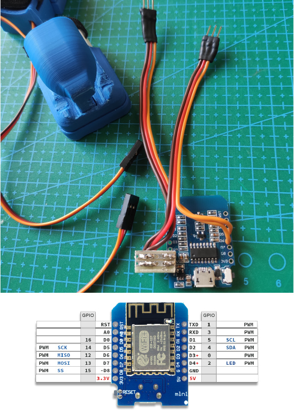

Welcome to the hardware assembly section!
+++++++++++++++++++++++++++++++++++++++++

In this section we will guide you to put together all the components to make the Simple Thimble!

.. caution::
    The project mechanics has been designed to be self produced with low-cost FDM (fused deposition modeling) 3D printing

.. danger:: 
    To obtain properly working 3D printed mechanical parts, you may need to file some parts to make them fit together. Moreover, soldering parts is needed to make this project.
    Always wear the proper **safety equipment**. This includes ``safety glasses`` to protect your eyes from flying debris, a ``face mask`` to protect your lungs from fumes, and ``gloves`` to protect your hands from heat and sharp edges. Additionally, it is important to work in a *well-ventilated* area to reduce the risk of inhaling toxic fumes.

Tools Required 
=============== 
* Soldering Iron 
* Solder 
* Wire Strippers 

Assembly Instructions 
========================== 

.. note:: 
    Some assembly instructions can be swapped without affecting the final result. This is because the order of instructions does not always matter. For example, if two instructions are independent of each other, they can be swapped without changing the outcome.

|
|
Step 1: Create the servomotor-pinion assembly - cut and place the servo adapter to the pinion
-------------------------------------------------

The first step to build our thimble is to attach the pinion to the servomotor shaft. 
First, cut the excess extremities of the servo plastic adapter and press-fit it into 
the pinion.

.. image:: step1.gif
   :alt: step1
   :width: 350 px
   :align: center

|
|
Step 2: Create the servomotor-pinion assembly - mount the pinion-adapter assembly to the motor
-------------------------------------------------

This passage is straightforward, you just need to use the pinion as a modified servo adapter.

.. image:: step2.gif
   :alt: step2
   :width: 350 px
   :align: center

|
|
Step 3: Insert the rack and assamble with the servomotor-pinion assembly
-------------------------------------------------

Once you have the servo-pinion assembly, you can mount the rack in the main box. Then, keeping 
the rack to its final position (thimble to maximum compression), instert the servo-pinion assembly 
making sure to engage the pinion as low as possible on the rack.

.. image:: step3.gif
   :alt: step3
   :width: 350 px
   :align: center

|
|
Step 4: Mount the main cover on
-------------------------------------------------

Now you can mount the main cover on top of the main box by press fitting it in place.

.. image:: step4.gif
   :alt: step4
   :width: 350 px
   :align: center

|
|
Step 5: Secure the servomotor connection
-------------------------------------------------

Cheap servomotors such as the SG-90, do not offer quality cabling, so to increase the life of such 
servomotors it is strongly recommended to glue the cable coming out from the servo chassis to the 
chassis itself

.. image:: step5.gif
   :alt: step5
   :width: 350 px
   :align: center

|
|
Step 6: insert the back cover
-------------------------------------------------

Now you can insert the connector of the servomotor in the hole of the back cover. You can insert 
the back cover on the servo but not completely, we need some space for the next step.

.. image:: step6.gif
   :alt: step6
   :width: 350 px
   :align: center

|
|
Step 7: Insert the velcro strip and the neoprene tape
-------------------------------------------------

In the gap we left in the previous step we can now insert the suitably cut velcro strip necessary to secure 
the thimble to the finger. After that we can add the neoprene tape to the lower part of the thimble.

.. image:: step7.gif
   :alt: step7
   :width: 350 px
   :align: center

|
|
Step 8: Wear the SimpleThimble!
-------------------------------------------------

Now you can wear the SimpleThimble and test if the servomotor works, or with a `servo tester <https://amzn.eu/d/bgud9uM>`_, or by :ref:`programming 
our microcontroller<onboardFirmware>`.

.. image:: step8.gif
   :alt: step8
   :width: 350 px
   :align: center

|
|
Step 9: Solder connectors to the microcontroller
-------------------------------------------------

Our final step is to solder two male dupont connectors to our `D1 mini ESP8266 board <https://amzn.eu/d/aI0mK40>`_. 
Specifically the Ground cable (usually black or brown) and the Power pin (usually red) respectively to the pin 
G (GND or Ground) and the pin 5V of the D1 mini ESP8266 board. The control cable of the two servomotors must be 
soldered to IO pins D5 (`GPIO <https://en.wikipedia.org/wiki/General-purpose_input/output>`_ 14) and D6 (GPIO 12) 
of the D1 mini ESP8266 board.

|

Another important thing to solder is a connector for the battery.
