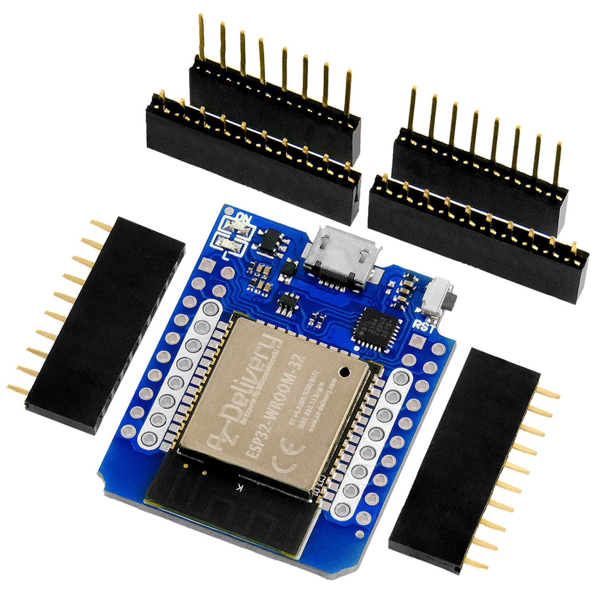

Hardware Overview of Simple Thimble
++++++++++++++++++++++++++++++++++++

Simple Thimble is a DIY haptic thimble that provides tactile feedback to the user. It is designed to be easy to assemble and use, and can be used for a variety of applications.

Components
===========

Simple Thimble consists of the following components:

-   an ESP32 microcontroller
-   an ESP8266 microcontroller (WeMoS D1 mini)
-   a battery shield for the D1 mini board
-   a Li-Po 3.7V battery
-   a standard SG90 servomotor
-   a switch

-   3D printed thimble parts

Parts role inside the thimble
===============================

In the following we will analyze the role that each of the hardware components will have in our thimble.

The ESP32 microcontroller
---------------------------

The ESP32 microcontroller function as a dongle in our application. It will be connected via USB to the 
computer to bridge wirelessly received data into the computer using serial communication. The use of the 
popular ESP32 microcontroller will allow us to use the ESP-NOW protocol to have a reliable connection 
success between modules. Moreover, we don't have to deal with bluetooth protocol version, which may not 
be present or vary from one pc to the other.

