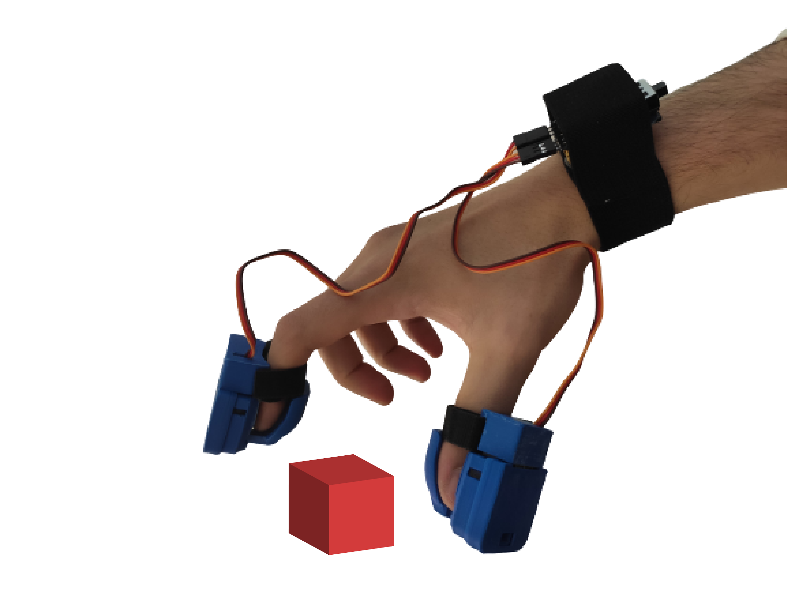

Welcome to Simple Thimble!
+++++++++++++++++++++++++++++++++++++++++

**Simple Thimble** is an *open-source* and *low-cost* project to build your own VR-enabled force feedback device. It is designed to be easy to 
assemble and use, and can be used with ``Unity`` virtual environment development platform. Moreover the :ref:`3D models<3dPrintingIntro>` for this device can be downloaded from this guide and 3D printed at home!

Features
-------------------------------------------------------

* Open-source: All the hardware and software components are open-source, so you can customize the device to your needs. 
* Low-cost: Simple Thimble is designed to be affordable, so anyone can build 
  their own force feedback device. 
* Easy to assemble: The device is designed to be easy to assemble, so you 
  don't need any special tools or skills. 
* Compatible with Unity: Simple Thimble is compatible with Unity virtual 
  environment development platform, so you can use it while developing virtual world applications.
* Force feedback: Simple Thimble provides realistic force feedback, so you can feel the environment in virtual reality. 

.. raw:: html
  
  <iframe style="display: block; margin: auto;" width="560" height="315" src="https://www.youtube.com/embed/zOBeJnWOoPM" title="YouTube video player" frameborder="0" allow="accelerometer; autoplay; clipboard-write; encrypted-media; gyroscope; picture-in-picture" allowfullscreen></iframe>
