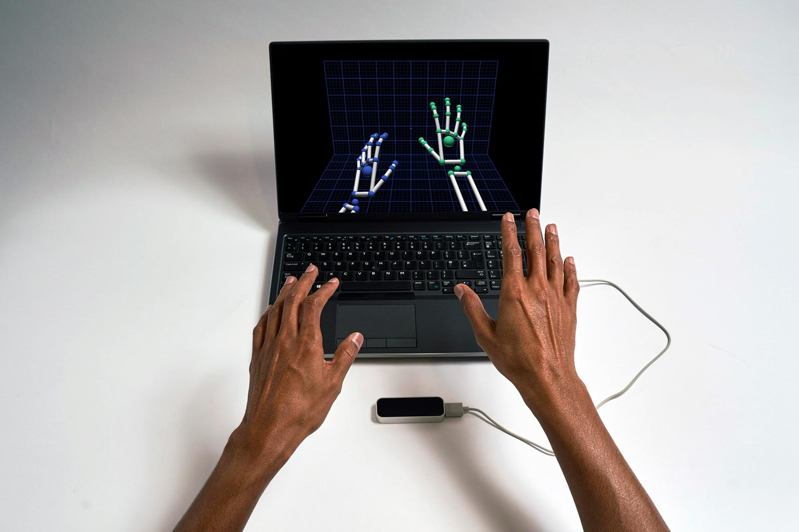

VR application: how to use the SimpleThimble in virtual reality
+++++++++++++++++++++++++++++++++++++++++++++

In this section we will see how to use the SimpleThimble in a emblematic virtual reality (VR) application: grasping a virtual cube. 
To do this we will use `Unity <https://unity.com/>`_, one of the most popular IDEs for desinging both 2D and 3D 
applications, such as games but also VR scenarios.

In order to track movements of our hand we will use the `Leap Motion <https://www.ultraleap.com/product/leap-motion-controller/>`_, 
a compact optical solution specialized in tracking hand movements.

|