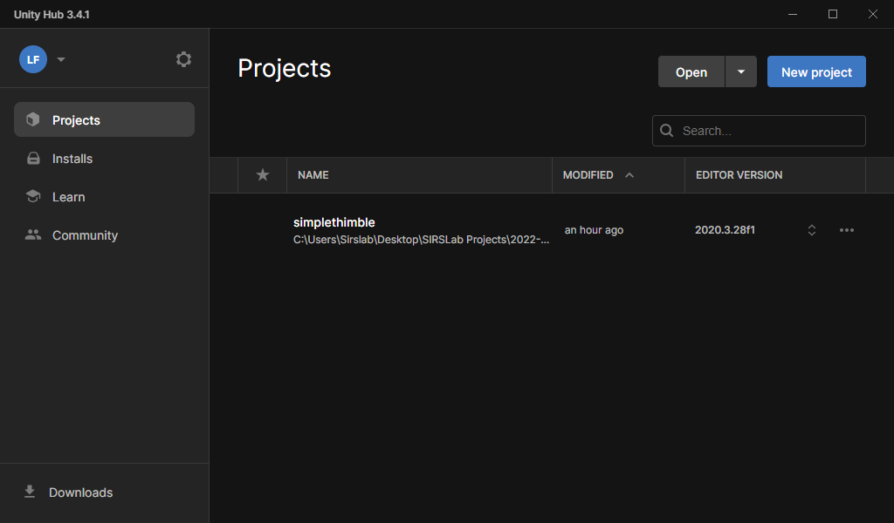
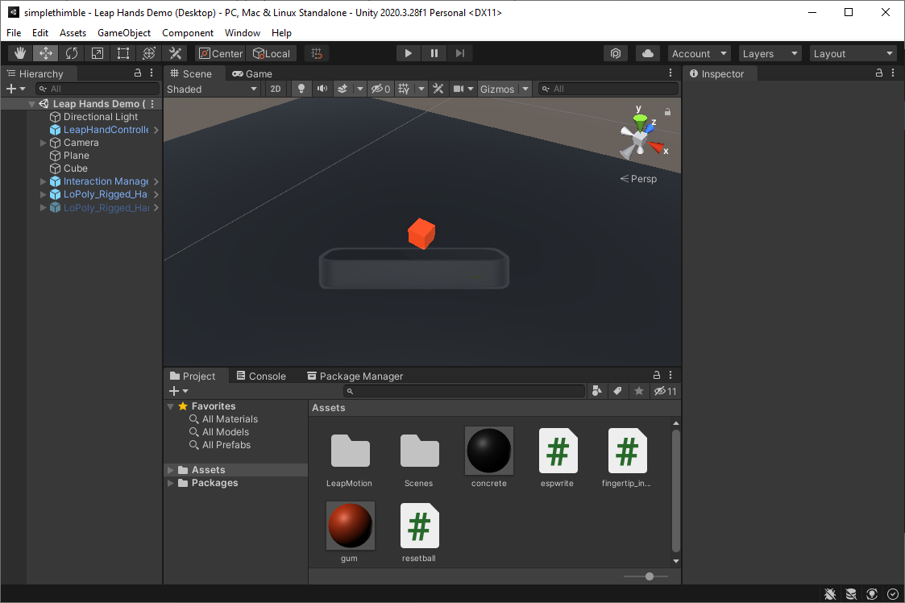
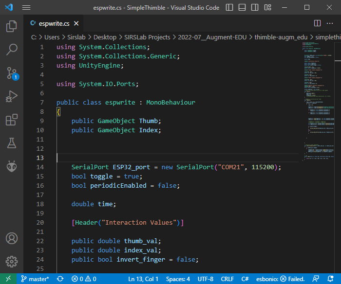

Let's connect the SimpleThimble to Unity and Leap Motion
++++++++++++++++++++++++++++++++++++++++++++++++++++++++++

Download the SimpleThimble unity project
=========================================
You can proceed to download the Unity project to use the SimpleThimble :download:`here <simplethimble.rar>`.
Once you downloaded this compressed file, you can extract the folder named "simplethimble" and open it with Unity 2020.3.28f1.
Make sure to open the project in unity hub and select the correct version of the IDE before opening it:

|

once you opened the project you should see this page of the IDE:

|

Now the only important thing to do is to insert the correct number of COM port inside the C# script that you will find in the 
path *"Assets/espwrite.cs"*. You can open it by double clicking its icon in the project folder box of the IDE and this will be opened in 
Visual studio IDE. you should modify the COM number which is at line 14, according to the enumeration you computer gave to the 
ESP32 based dongle.

|

In this case my dongle was numbered as **COM21**.
Now make sure to connect both the ESP32 dongle and the Leap Motion to your computer and then open the Unity project. 
Now click on ``Game`` then ``Maximize on play`` and the click the play button.

.. image:: unity-first-play.gif
   :alt: pref
   :width: 700 px
   :align: center

|