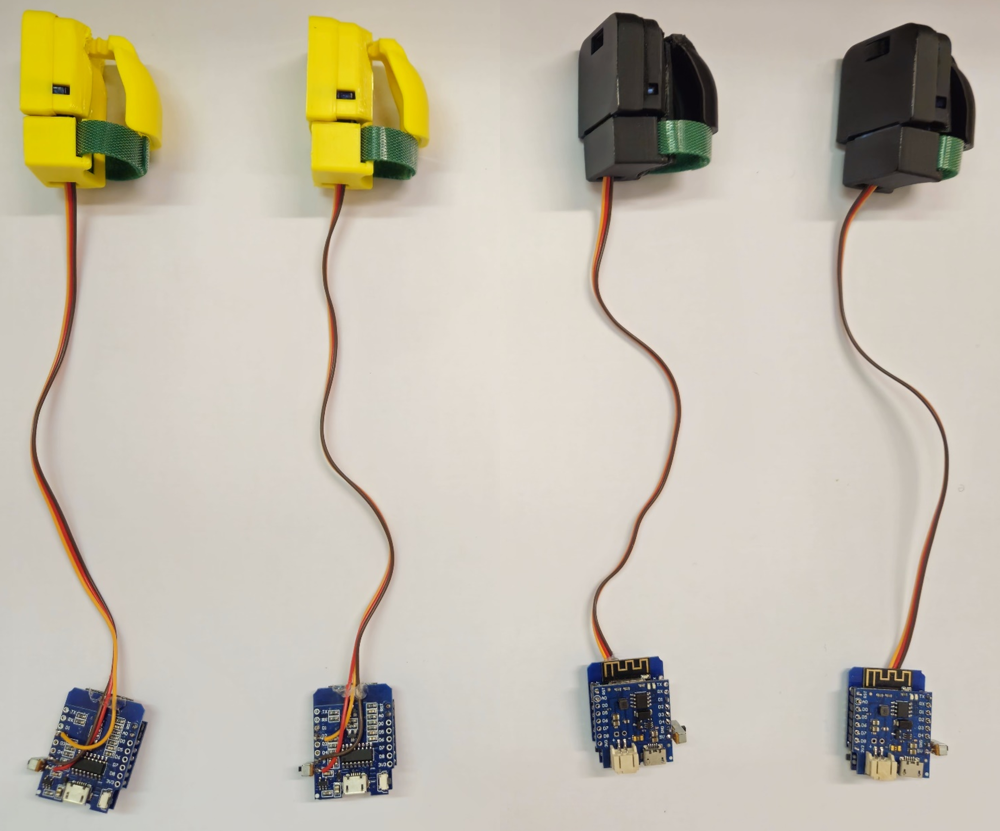

SimpleThimble Course: Overview and Objectives
=============================================

Welcome to the SimpleThimble Course! This course is designed to help you understand the principles of haptic feedback and how to implement them using the SimpleThimble device. By the end of this course, you will have a solid understanding of haptic feedback, the hardware components of the SimpleThimble, and how to develop applications for the device.

You will learn how to:

- Assemble the SimpleThimble device
- Program the firmware for the device
- Develop VR applications using the SimpleThimble

Participants are asked to be divided into groups of 3-4 people. Each group receive the necessary components to assemble the device as shown in the following figure:

.. image:: components_course_2.png
   :alt: pref
   :align: center
   :width: 400px

|

The final devices will be used to develop a virtual reality application that demonstrates the capabilities of the SimpleThimble device. The application will allow users to interact with virtual objects and feel the haptic feedback generated by the device.
The version of the device includes a thimble to be worn on the index finger, which is used to interact with the virtual environment:

|

The material provided includes:

- Firmware for microcontrollers: :download:`here <simpleThimble_firmware.rar>`.
- Unity package for virtual reality applications: :download:`here <simpleThimble_course.unitypackage>`.

The next page will guide you in setting up the necessary software to start developing applications for the SimpleThimble.
