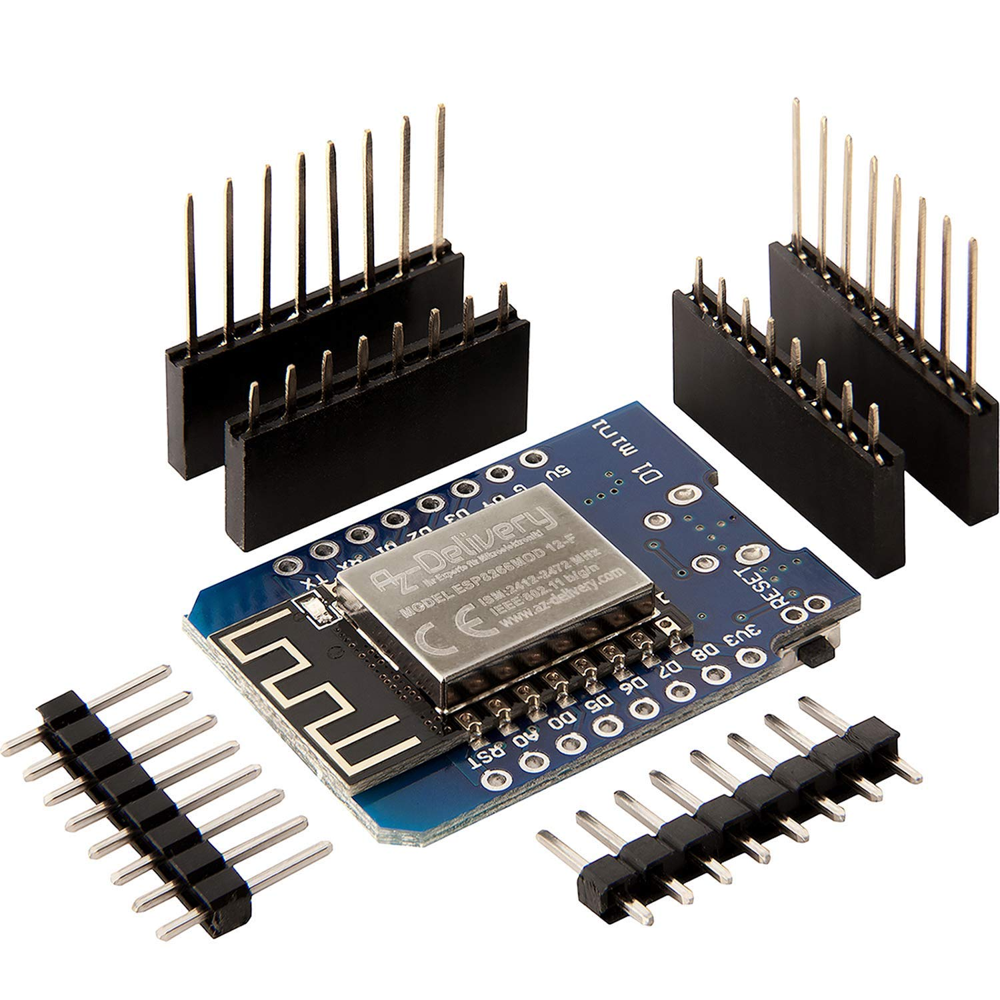
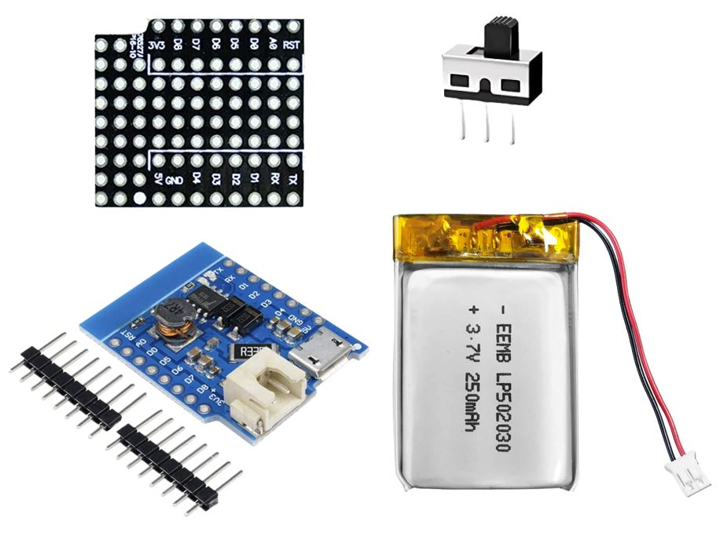
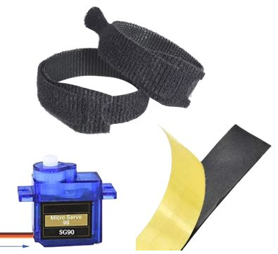

Hardware Overview of Simple Thimble
++++++++++++++++++++++++++++++++++++

Simple Thimble is a DIY haptic thimble that provides tactile feedback to the user. It is designed to be easy to assemble and use, and can be used for a variety of applications.

Components
===========

Simple Thimble consists of the following components:

-   an ESP32 microcontroller
-   an ESP8266 microcontroller (WeMoS D1 mini)
-   a battery shield for the D1 mini board
-   a Li-Po 3.7V battery
-   a switch
-   a standard SG90 servomotor
-   3D printed thimble parts
-   velcro strips
-   neoprene tape

Parts role inside the thimble
===============================

In the following we will analyze the role that each of the hardware components will have in our thimble.

The ESP32 microcontroller
---------------------------
.. image:: items/esp32board.jpg
   :alt: esp32board
   :height: 150px
   :width: 150px
   :align: right
The ESP32 microcontroller function as a dongle in our application. It will be connected via USB to the 
computer to bridge wirelessly received data into the computer using serial communication. The use of the 
popular ESP32 microcontroller will allow us to use the ESP-NOW protocol to have a reliable connection 
success between modules. Moreover, we don't have to deal with bluetooth protocol version, which may not 
be present or vary from one pc to the other.

The ESP8266 microcontroller
---------------------------

The ESP8266 microcontroller is the wearable ESP microcontroller which will recieve data wirelessly from 
the dongle connected to the computer. This microcontroller will control also the two servomotors which 
are inside each thimble.

Other electronic components (battery shield, proto shield, Li-Po battery, switch)
---------------------------------------------------------------------------------------

Those parts are useful to make the connection of all components faster. The battery shield 
is used to add the circuit necessary to charge a Li-Po battery. The proto shield is used to easily make 
connections between the microcontroller, servomotors, battery management circuit and switch.

Other mechanical and mechatronic components (servomotors, velcro strips and neoprene tape)
---------------------------------------------------------------------------------------

Those parts are necessary to assemble the thimble. The servomotor is needed to convert the electrical 
control signals to the mechanical motion necessary to apply the pressure to the fingertip pulp. Velcro 
strips are necessary to secure the thimble to the finger and the neoprene tape is applied to make the 
thimble more comfortable.
