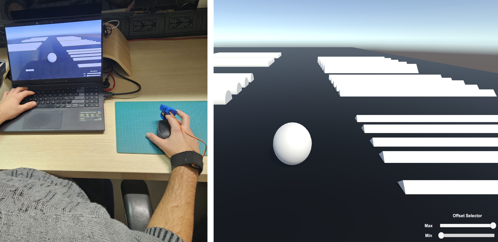

VR Application: Desktop 
+++++++++++++++++++++++++++++++++++++++++++++

This project aims at get acquainted with the SimpleThimble without using any tracking device. The idea is to move a virtual sphere on a surface populated with obstacles of varying shapes and heights. Users can move the sphere using the mouse or trackpad of their computer. In this scenario, we are using a simplified version of the SimpleThimble, which is composed of only of thimble to be worn on the index finger. This also proved the modularity of the SimpleThimble project, as we can easily adapt the hardware to different scenarios.

|

.. note::
   To adapt the SimpleThimble for the following demo, unplug the thimble used on the thumb and use only the thimble for the index.
|

Prerequisites
-------------

Before you begin, ensure that you have the following:
- A PC with Windows 10 or later (macOS is not supported for Oculus development with Unity).
- Unity Hub installed on your PC.

**Step 1**: Download and Open the SimpleThimble Unity Project
---------------------------------------------------------

**Download the SimpleThimble Unity package**: :download:`here <SimpleThimble_desktopApp.unitypackage>`.

**Open the Project in Unity**:  
   - Open **Unity Hub**.
   - Create a new Unity project with the 3D template.
   - Drag and drop the downloaded package to the Assests of your project.
   - It might be necessary to solve a problem for the SerialPort. If so, go to **Edit -> Project Settings -> Player -> Other Settings -> Configuration -> Api Compatibility Level** and select: .NET Framework

**Run the Project**:  
   - Adjust the resolution in Game window to ``Full HD (1920x1080)``.
   - Press the Play button to run the project.

**[Optional]** Make an executable file for running the development
--------------------------------------------------------------

**Build Settings**:  
   - Go to **File -> Build Settings**.
   - Add the current scene to the build.
   - Select the target platform (Windows, Mac, Linux).
   - Press Build and Run.

**Step 2**: Play the Game
---------------------
When running the project, you should see an environment similar to the following image:

.. image:: start_desktop.png
   :alt: pref
   :width: 700 px
   :align: center

|

In the application, you need to select the ``COM`` port where the dongle is connected to your computer. Additionally, at the bottom right corner, you will see two sliders for offset adjustments. These offsets are used to set the minimum and maximum values of the force feedback. On the right side, there is a ``Debug`` panel for debugging without opening the serial connection. Once you press the ``Start`` button, you can move the sphere using your mouse or trackpad. The sphere will navigate the surface and collide with obstacles, while the thimble generates force feedback upon collision. The demo will look like the following:

.. image:: desktopApp.gif
   :alt: pref
   :width: 700 px
   :align: center

|
