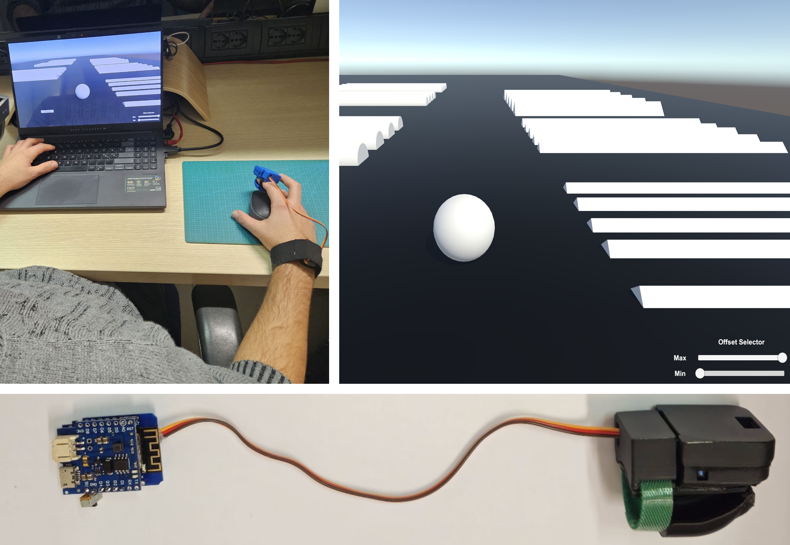

Move a virtual sphere on a surface populated with obstacles of varying shapes and heights
+++++++++++++++++++++++++++++++++++++++++++++

This project aims at get acquainted with the SimpleThimble without using any tracking device. The idea is to move a virtual sphere on a surface populated with obstacles of varying shapes and heights. Users can move the sphere using the mouse or trackpad of their computer. In this scenario, we are using a simplified version of the SimpleThimble, which is composed of only of thimble to be worn on the index finger. This also proved the modularity of the SimpleThimble project, as we can easily adapt the hardware to different scenarios.

|

Prerequisites
-------------

Before you begin, ensure that you have the following:
- A PC with Windows 10 or later (macOS is not supported for Oculus development with Unity).
- Unity installed on your PC.

Step 1: Download and Open the SimpleThimble Unity Project
---------------------------------------------------------

