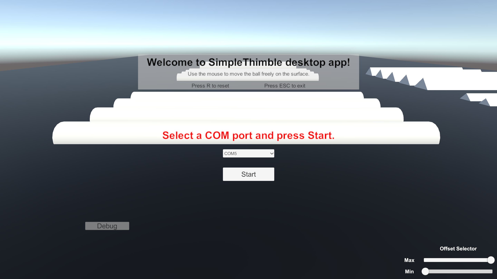

Move a virtual sphere on a surface populated with obstacles of varying shapes and heights
+++++++++++++++++++++++++++++++++++++++++++++

This project aims at get acquainted with the SimpleThimble without using any tracking device. The idea is to move a virtual sphere on a surface populated with obstacles of varying shapes and heights. Users can move the sphere using the mouse or trackpad of their computer. In this scenario, we are using a simplified version of the SimpleThimble, which is composed of only of thimble to be worn on the index finger. This also proved the modularity of the SimpleThimble project, as we can easily adapt the hardware to different scenarios.

.. image:: desktop_app.png
   :alt: pref
   :width: 700 px
   :align: center

|

Prerequisites
-------------

Before you begin, ensure that you have the following:
- A PC with Windows 10 or later (macOS is not supported for Oculus development with Unity).
- Unity installed on your PC.

Step 1: Download and Open the SimpleThimble Unity Project
---------------------------------------------------------

1. **Download the SimpleThimble Unity package**:  
   `Download here <SimpleThimble_desktopApp.unitypackage>`.

2. **Open the Project in Unity**:  
   - Open **Unity Hub**.
   - Create a new Unity project with the 3D template.
   - Drag and drop the downloaded package to the Assests of your project.
   - It might be necessary to solve a problem for the SerialPort. If so, go to Edit -> Project Settings -> Player -> Other Settings -> Configuration -> Api Compatibility Level -> .NET Framework

3. **Run the Project**:  
   - Adjust the resolution in Game window to Full HD (1920x1080).
   - Press the Play button to run the project.

[Optional] Step 2: Make an executable file for running the development
---------------------------------------------------------------------

**Build Settings**:  
   - Go to File -> Build Settings.
   - Add the current scene to the build.
   - Select the target platform (Windows, Mac, Linux).
   - Press Build and Run.

Step 3: Play the Game
---------------------
When running the project, you should see an environment similar to the following image:

|

From here you have to select the COM port where the dongle is attached to your computer. Moreover, on the right bottom corner, you can see two sliders for offset. The offset are used to set the minimum and maximum values of the force feedback. On the right side there is a panel for debugging, without the need to open the serial connection. Once you have pressed the Start button, you can move the sphere using the mouse or trackpad of your computer. The sphere will move on the surface and collide with the obstacles. The thimble will produce force when the sphere collides with an obstacle. The demo will be as the following:

.. image:: desktopApp.gif
   :alt: pref
   :width: 700 px
   :align: center

|
