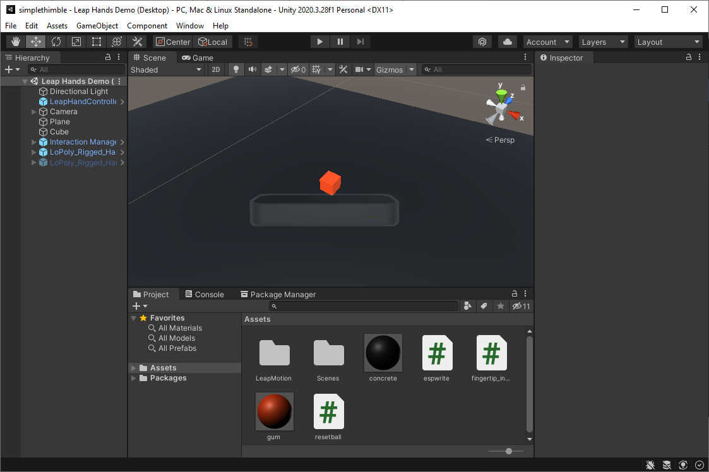
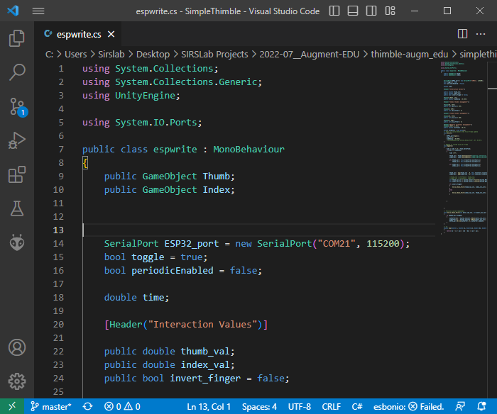

VR Application: Grasp a Virtual Object Using Leap Motion
=======================================================

The Leap Motion controller is a hand-tracking device that uses a combination of cameras and infrared sensors to track the movement of hands and fingers with high accuracy and low latency.

.. image:: leap-motion.jpg
   :alt: Leap Motion Controller
   :width: 700 px
   :align: center
|

This guide explains how to set up Leap Motion hand tracking with Unity using the Leap Motion Unity Modules, Core Assets, and Interaction Engine.

Prerequisites
-------------

Ensure you have the following:

- **PC Requirements**: Windows 10 or later, or macOS.
- **Hardware**: Leap Motion Controller or Ultraleap device, ESP32-based dongle, and SimpleThimble thimbles.
- **Unity Installation**: Unity 2020.3.28f1 or later (LTS versions recommended).
- **Software Tools**: Unity Hub, Visual Studio (for script editing).

Downloading Leap Motion Orion
-----------------------------

We will need a specific version of Leap Motion called Orion, as this developer kit integrates well with Unity packages.

To download **Leap Motion Orion 4.1.0**, click `here <https://developer-archive.leapmotion.com/downloads/external/v4-1-hand-tracking/windows?version=4.1.0>`_.

After installation, attach your Leap Motion to the PC and launch the Leap Motion visualizer to ensure it is working correctly. You should see an interface similar to this:

.. image:: leap-visual.gif
   :alt: Leap Motion Visualizer
   :width: 700 px
   :align: center

|

The following steps will guide you through setting up the SimpleThimble Unity project with Leap Motion hand tracking.

Step 1: Download and Open the SimpleThimble Unity Project
---------------------------------------------------------

1. **Download the SimpleThimble Project**:  
   `Download here <simplethimble.rar>`_.
2. **Extract the Folder**:  
   Extract the ``simplethimble`` folder from the compressed file.
3. **Open the Project in Unity**:  
   - Open **Unity Hub**.
   - Add the extracted project folder.
   - Select **Unity 2020.3.28f1** as the version for the project.

After opening the project, you should see a Unity IDE environment similar to this:

Step 2: Configure the ESP32 Dongle for SimpleThimble
----------------------------------------------------

1. Locate the C# script ``espwrite.cs`` in the Unity Project:
   - Path: ``Assets/espwrite.cs``.
2. Open the script in Visual Studio by double-clicking its icon.
3. Modify the COM port number at **line 14** to match the port assigned to your ESP32 dongle.  
   Example: Change ``COM21`` to the correct COM port for your computer.

4. Save the changes and return to Unity.

Step 3: Install Leap Motion Unity Modules
-----------------------------------------

1. **Download and Import Leap Motion Unity Modules**:
   - **Version 4.8.0**: `Download here <https://www2.leapmotion.com/downloads/unity-modules/v4.8.0>`_.
   - Import into Unity:
     - Go to **Assets > Import Package > Custom Package**.
     - Select the ``.unitypackage`` file and follow the prompts.

2. **Install Leap Motion Core Assets**:
   - **Version 4.3.4**: `Download here <https://github.com/ultraleap/UnityPlugin/releases/download/Release-CoreAsset-4.3.4/Leap_Motion_Core_Assets_4.3.4.unitypackage>`_.
   - Import into Unity using the same process as above.

3. **Install Leap Motion Interaction Engine**:
   - **Version 1.1.1**: `Download here <https://github.com/ultraleap/UnityPlugin/releases/download/Release-InteractionEngine-1.1.1/Leap_Motion_Interaction_Engine_1.1.1.unitypackage>`_.
   - Import into Unity.

4. **Add Leap Motion Components to Your Scene**:
   - Add the **LeapXRServiceProvider** prefab to your scene.
   - Configure Unity's XR settings:
     - Go to **Edit > Project Settings > XR Plug-in Management**.
     - Ensure the project is compatible with your VR platform.

Step 4: Test SimpleThimble with Leap Motion
-------------------------------------------

1. **Connect Devices**:
   - Connect the Leap Motion Controller and ESP32 dongle to your PC.
   - Ensure the SimpleThimble thimbles are battery-powered.

2. **Start the Project**:
   - Open the project in Unity.
   - Click on **Game** view and select **Maximize on Play**.
   - Press the Play button in Unity.

.. image:: unity-first-play.gif
   :alt: Unity First Play
   :width: 700 px
   :align: center

3. **Interact with the Scene**:
   - Move your hand over the Leap Motion Controller to see it in the Unity scene.
   - Touch the cube with the SimpleThimble thimbles to experience haptic feedback.

.. image:: unity-live-thimble-test.gif
   :alt: Thimble Interaction
   :width: 700 px
   :align: center

4. **Reset the Cube**:
   - If the cube falls out of the Leap Motion workspace, press **"R"** on your keyboard to reset it to its initial position.

Final Step: Grasp and Feel the Virtual Cube
-------------------------------------------

Wear the SimpleThimble devices, grasp the red cube in the scene, and feel the cutaneous haptic feedback.

.. image:: unity-grasping.gif
   :alt: Grasping the Cube
   :width: 700 px
   :align: center

Additional Resources
--------------------

- `Leap Motion Developer Documentation <https://developer.leapmotion.com/>`_
- `Unity Asset Store <https://assetstore.unity.com/>`_
- `Unity Tutorials for VR Development <https://learn.unity.com/>`_

Troubleshooting
---------------

1. Verify the Leap Motion Controller and ESP32 dongle are properly connected.
2. Ensure you are using the correct Unity version and modules.
3. For Leap Motion issues, visit the `Leap Motion Support Center <https://support.leapmotion.com/>`_.
