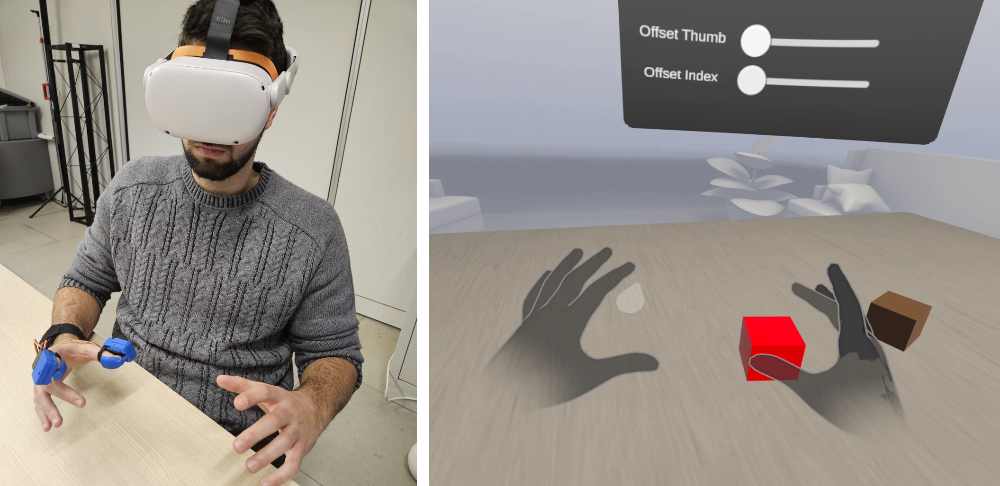

VR Application: Oculus Quest
==========================================================================

The Oculus Quest is a standalone VR headset developed by `Meta <https://meta.com/>`_ that does not require a computer to operate. It is ideal for VR applications, as it is wireless and features an advanced tracking system. Using inside-out tracking, the headset's cameras monitor the user's position in physical space. This enables a more immersive and interactive VR experience, allowing users to move freely without being tethered to a computer. Below is an image showing the application in action on the Oculus Quest 2 headset:

|

Prerequisites
-------------

Before starting, ensure you have the following:

- A PC with Windows 10 or later (macOS is not supported for Oculus development with Unity).
- An Oculus Quest 2, Quest 3, or Pro headset.
- A compatible USB cable (e.g., Oculus Link cable or USB 3.0 cable for Quest devices).
- Unity Hub installed on your PC.

**Step 1**: Install Oculus Software
-------------------------------

Download and install the Oculus PC app (for Oculus Link). This software is required to connect your Oculus device to your PC for development.

- **Download link:** `https://www.meta.com/quest/setup/ <https://www.meta.com/quest/setup/>`_

After installation:

1. Open the app and follow the on-screen instructions to set up your Oculus device.
2. Enable **Developer Mode** in the Oculus smartphone app (details in Step 2).

**Step 2**: Enable Developer Mode
-----------------------------

1. Install the **Meta Quest Developer Hub** on your PC:
   - **Download link:** `https://developer.oculus.com/downloads/ <https://developer.oculus.com/downloads/>`_

2. Log in using your Meta (Oculus) developer account.
   - If you don’t have an account, create one here: `https://developer.oculus.com/sign-up/ <https://developer.oculus.com/sign-up/>`_

3. Connect your Oculus device to the Meta Quest Developer Hub and toggle **Developer Mode** on.

**Step 3**: Install Unity
---------------------

1. In Unity Hub, install a Unity Editor version compatible with the Oculus Integration SDK.
   - Recommended: Unity LTS version (e.g., Unity ``2021.3.26f1`` or higher, for compatibility with the ``Meta XR SDK``).

2. During installation, include the following modules:
   - **Android Build Support** (required for Oculus Quest development).

**Step 4**: Install Oculus Integration in Unity
-------------------------------------------

1. Open Unity and create a new 3D project.
2. Once the project is open, go to **File > Build Settings** and select **Android** as the platform.
3. Access the **Asset Store**:
   - In Unity, click **Window > Asset Store** (or open `https://assetstore.unity.com/ <https://assetstore.unity.com/>`_ in your browser).
4. Search for **Meta XR All-in-one** and download/import it into your project (tested with Meta version ``72.0``).
5. After importing, a window will appear for ``Meta XR Interaction``. Keep using the ``OVR Hand``.
6. Import the sample scenes from Meta XR Interaction via the Package Manager.

.. note::

   We use the Meta XR All-in-one package as it includes the Meta Core for visualization, Meta Interaction modules for physical interaction, and other useful demos.

|

**Step 5**: Configure Unity for VR Development
------------------------------------------

1. Go to **Edit > Project Settings > XR Plug-in Management** and enable **Oculus**.
2. Configure player settings:
   - Navigate to **Edit > Project Settings > Meta XR** and resolve all potential issues.

**Step 6**: Download the SimpleThimble Oculus Unity Package
------------------------------------------------

1. Download the SimpleThimble Oculus Unity package: :download:`here <SimpleThimble_oculusApp.unitypackage>`.
2. Import the package into Unity by dragging and dropping it into the **Assets** folder of your project.
3. In the Project window, navigate to the ``Scenes`` folder and open the Oculus demo.

.. note::
   This project uses UDP (User Datagram Protocol) for communication between the virtual scene and the thimbles. To enable this functionality, upload a specific firmware to the thimble (ESP8266). This provides a standalone solution, making the project more accessible.

|

**Step 7**: Connect the SimpleThimble via UDP and Run the Project
----------------------------------------

1. Download the firmware for the standalone version of the SimpleThimble: :download:`here <SimpleThimble_standaloneFirmware.rar>`.
2. Connect the ESP8266 to your computer and upload the firmware using Arduino IDE.
3. Turn on the thimble and connect to the network ``simplethimble`` using the password ``password``.
4. Run the project in Unity. The following scene should appear:

.. image:: oculusApp.gif
   :alt: Oculus demo scene
   :width: 500 px
   :align: center

|

In the application, you can use your hands directly to interact with the virtual environment. The thimbles provide haptic feedback when touching virtual objects. Additionally, you can adjust the thimbles' offset using sliders with your left hand.

.. note::
   The right hand consists of two overlapping virtual hands. One serves for interaction (penetrating objects to compute haptic feedback), while the other provides visualization to simulate physical interaction.
|
